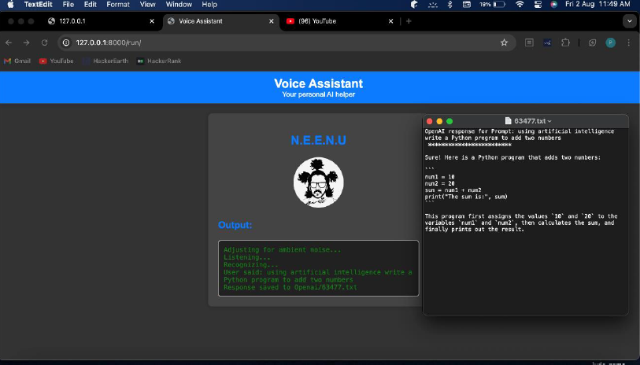
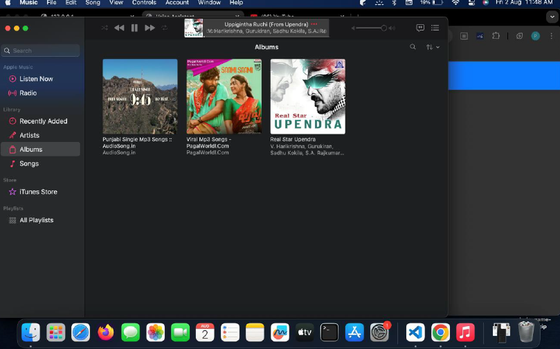
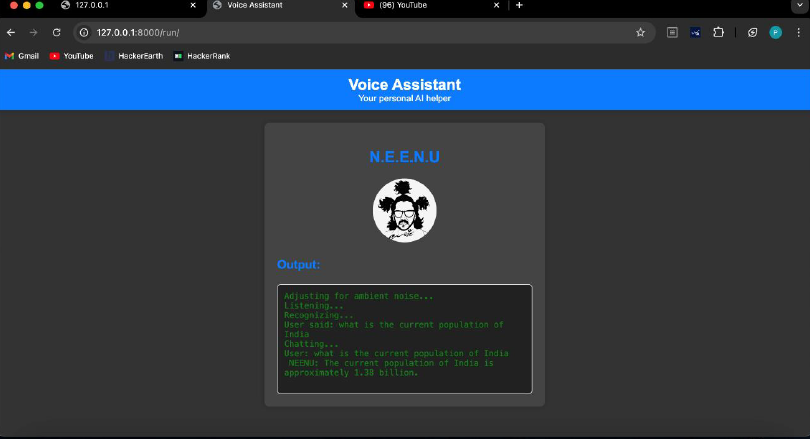

# N.E.E.N.U - Voice Assistant

## 📖 Project Overview

N.E.E.N.U is an **AI-powered voice assistant** with a **web interface**, developed using Python and Django. It can recognize voice commands, execute tasks like opening websites, playing music, and answering queries using OpenAI's GPT model.

---

## 📸 Output Screenshots

### 1. Main Interface with Voice Command Processing

### 2. Example - Generating Python Code using AI

### 3. Example - Playing Music

### 4. Example - Querying Population Data

---

## 🚀 Features

- 🎙️ **Voice Command Recognition** - Understands and processes voice commands.
- ⚙️ **Task Execution** - Opens websites, plays music, launches apps, and performs system actions.
- 🧠 **AI Responses** - Provides intelligent replies using **GPT-3.5-turbo**.
- 🌐 **Web Interface** - Easy-to-use **Django web page** to interact with the assistant.

---

## ⚙️ How It Works

1. Access the web interface via `http://127.0.0.1:8000/run`.
2. Speak your command after clicking the **Start** button.
3. The assistant will listen, process the command, and display/log the response.
4. N.E.E.N.U can handle requests such as:
    - Opening websites
    - Fetching weather updates
    - Playing local music
    - Writing code using AI
    - Opening apps like Notepad, Calculator, etc.

---

## 🔧 Usage Instructions

- Clone the repository.
- Run the Django server.
- Access `http://127.0.0.1:8000/run` in your browser.
- Speak commands directly into the interface.

---

## 🛠️ Technologies Used

- Python
- Django (Web Framework)
- SpeechRecognition
- OpenAI API (GPT-3.5 Turbo)
- Webbrowser & OS modules for system tasks
- HTML, CSS for web interface

---

## 👨‍💻 Author

Developed by [Your Name / Team Name]

---

